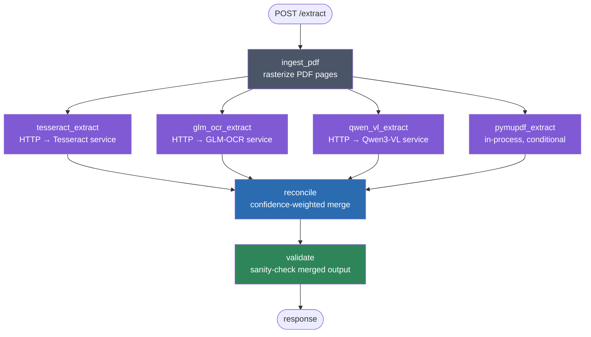

# Agent Nodes — Supervisor Graph

Documents the LangGraph agent topology defined in `services/supervisor/app/graph.py`: what each node does, how they connect, and which multi-agent pattern this follows.

## The pattern: orchestrator + parallel workers

This is a **supervisor** — a central coordinating node that fans work out to specialized worker nodes and synthesizes their results into one output. Anthropic's engineering post [*Building Effective Agents*](https://www.anthropic.com/engineering/building-effective-agents) describes the closest named pattern, **orchestrator-workers**:

> "A central LLM dynamically breaks down tasks, delegates them to worker LLMs, and synthesizes their results."

That post also describes a related, simpler pattern, **parallelization**, with two variants — *sectioning* (splitting one task into independent parts) and *voting* (running the same task multiple times for diverse outputs, then aggregating programmatically).

**Where this graph actually sits between the two:** it's a supervisor node (`ingest_pdf` → fan-out → `reconcile` → `validate`) synthesizing worker output, matching orchestrator-workers' *topology*. But the delegation is **static, not dynamic** — the same four workers run on every request (subject to PyMuPDF's own conditional self-skip when there's no usable text layer); there's no LLM in the supervisor deciding *which* workers to invoke or *how* to decompose the input. That's closer to parallelization's **voting** variant, generalized from "run the same prompt N times" to "run the same task via N different tools/models," with the aggregation step upgraded from a plain majority vote to confidence-weighted merge (`shared/confidence.py`). So: orchestrator-workers *shape*, parallelization-voting *delegation logic*, custom weighted-voting *aggregation*.

## Graph topology

Four workers fan out from `ingest_pdf` and fan back into `reconcile` — a classic fork-join. Every worker writes to its **own** state keys (`{prefix}_result`, `{prefix}_duration_ms`, `{prefix}_start_time`, `{prefix}_end_time`), so they can run truly concurrently with no shared-write conflicts; `reconcile` only proceeds once all four have completed (or failed — see below).

## Nodes

| Node | Type | What it does | On failure |
|---|---|---|---|
| `ingest_pdf` | Prep | Rasterizes PDF pages to images at `OCR_DPI` (default 300) for the image-based workers. | Propagates — nothing downstream can run without it. |
| `tesseract_extract` | Worker | HTTP call to the Tesseract service; image OCR + regex-based structured parsing (`shared/pcb_parser.py`). | Retries 3× w/ backoff, then contributes `None` — reconciliation proceeds with the remaining workers. |
| `glm_ocr_extract` | Worker | HTTP call to the GLM-OCR service; vision-LLM structured extraction. | Same retry/degrade behavior. |
| `qwen_vl_extract` | Worker | HTTP call to the Qwen3-VL service; vision-LLM structured extraction. | Same retry/degrade behavior. |
| `pymupdf_extract` | Worker | Runs **in-process** (no HTTP, no GPU) — reads the PDF's own embedded text layer directly. **Self-skips** (contributes nothing, not an error) when the PDF has no substantial text layer — see `PDF_TEXT_LAYER_MIN_CHARS`. | No retries needed; it's a fast local operation. Exceptions are caught and logged as a soft failure, same as the others. |
| `reconcile` | Synthesis | `shared/confidence.py::safe_merge_results` — per-field confidence-weighted voting across however many workers actually produced a result (see field-selection rules below). | If *zero* workers produced anything, raises and the request fails. |
| `validate` | Post-check | Sanity-checks the merged output (e.g. board thickness in a plausible range, drill sizes in range) and records any issues as `errors`, without blocking the response. | Doesn't fail the request — validation issues are informational. |

### Per-field selection rule in `reconcile` (summary — full detail in `README.md`)

1. All contributing workers agree → use it, confidence boosted.
2. Strict majority (>50% of workers that produced a result) agree → majority value, confidence averaged.
3. No majority → highest-confidence worker's value wins.
4. Only one worker had a value → use it, confidence penalized.
5. No worker had it → `null`.

This selection logic is written generically over *N* workers, not hardcoded to any specific count — worth remembering if a 5th worker is ever added (see below).

## Adding a new worker node

Follow the existing pattern in `services/supervisor/app/nodes.py` and `state.py`:

1. Pick a `key_prefix` (e.g. `"my_engine"`). State needs four keys derived from it: `{prefix}_result`, `{prefix}_duration_ms`, `{prefix}_start_time`, `{prefix}_end_time` — add them to `PipelineState` in `state.py` and to `create_initial_state()`.
2. Write the node function. If it's an HTTP call to another service, reuse `_call_ocr_node(state, url, key_prefix, engine_name)` — it already handles retries, timing, and Pacific-time timestamps. If it runs in-process (like PyMuPDF), follow `pymupdf_extract_node` as the template, including the "self-skip cleanly, don't fabricate a result" behavior if the input doesn't suit this method.
3. Register it in `graph.py`: `add_node`, an edge from `ingest_pdf`, and an edge into `reconcile`.
4. Add its result to the candidates list in `reconcile_node` (`nodes.py`).
5. Give it a confidence base map in `shared/confidence.py::ENGINE_BASE_MAP` — see the existing four for the shape (per-field base confidence, tuned to what the method is actually good/bad at).
6. Add it to `_ENGINES` in `router.py` so `engine_durations_sec` reports it too.
7. **Run the full `make test` against every sample afterward** — the majority-vote math changes shape with worker count (see `CLAUDE.md` §5 for why this bit us with PyMuPDF).
